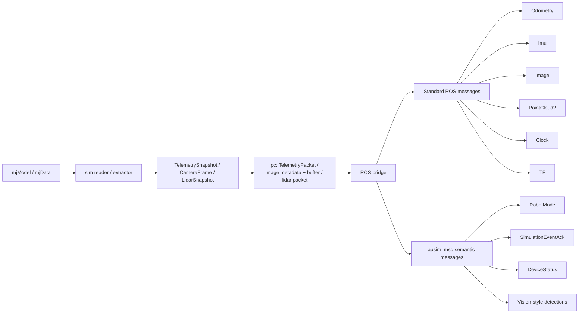
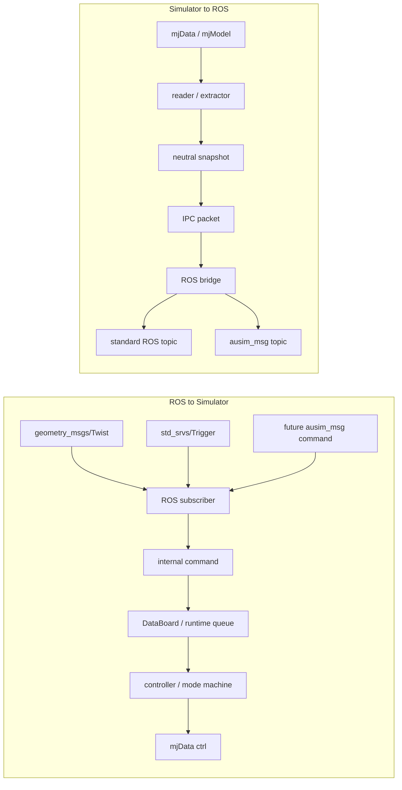

# ROS Message Architecture

`ausim_msg` is the semantic message layer for ausim2. It does not replace
standard ROS interfaces such as `geometry_msgs/Twist`, `nav_msgs/Odometry`,
`sensor_msgs/Image`, `sensor_msgs/Imu`, or `sensor_msgs/PointCloud2`.

## File Form

- `third_party/ausim_msg/msg/*.msg`
  - shared semantic interfaces available through ROS overlay `source`
  - includes vision-style example messages plus:
    - `RobotMode.msg`
    - `SimulationEvent.msg`
    - `SimulationEventAck.msg`
    - `DeviceCapability.msg`
    - `DeviceStatus.msg`
- `ausim_common/src/converts/ausim_msg/*.cpp`
  - internal snapshot / IPC packet to `ausim_msg` conversion
- `ausim_common/src/ros/publisher/semantic/*.cpp`
  - structured semantic publishers
- `ausim_common/src/ros/publisher/data/*.cpp`
  - standard ROS data publishers

## Data Flow

- control input:
  - `Twist` / `Trigger`
  - `-> ros subscriber`
  - `-> internal command`
  - `-> DataBoard / runtime`
  - `-> mjData->ctrl`
- telemetry output:
  - `mjModel/mjData`
  - `-> sim reader`
  - `-> TelemetrySnapshot`
  - `-> ipc::TelemetryPacket`
  - `-> ros bridge`
  - `-> standard ROS msgs`
  - `-> ausim_msg semantic msgs`

## Current Data-Flow Diagram

## ROS Topic <-> Simulator Bidirectional Chain

## Current Structured Route

The first live semantic route is:

`mjData -> TelemetrySnapshot -> ipc::TelemetryPacket -> RobotModePublisher -> ausim_msg/msg/RobotMode`

The legacy compatibility route remains in parallel:

`mjData -> TelemetrySnapshot -> ipc::TelemetryPacket -> std_msgs/String(JSON)`
