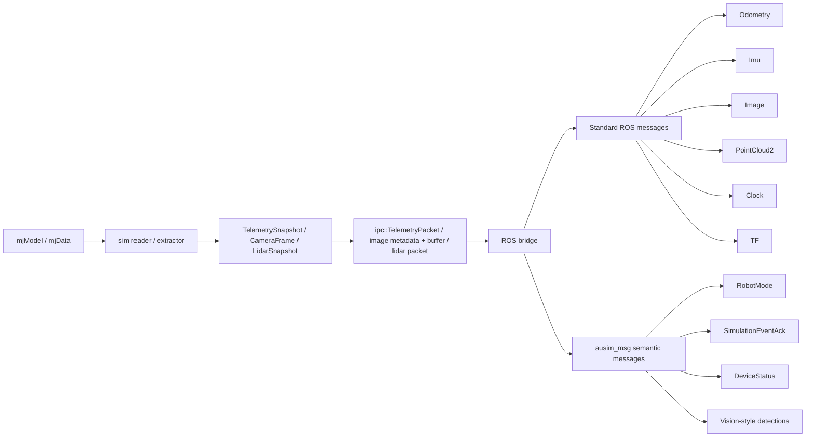
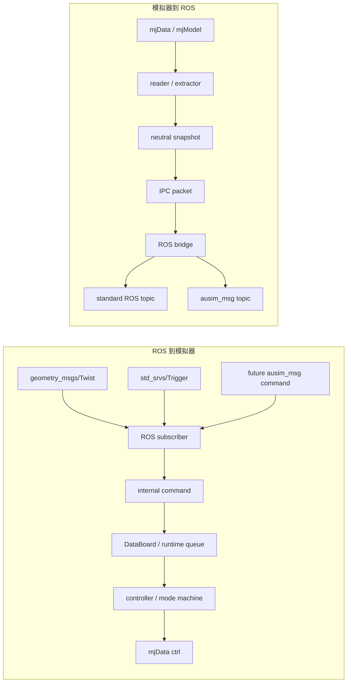

# ROS 消息架构

`ausim_msg` 是 ausim2 的语义消息层。它不会替代标准 ROS 接口，例如 `geometry_msgs/Twist`、`nav_msgs/Odometry`、`sensor_msgs/Image`、`sensor_msgs/Imu` 或 `sensor_msgs/PointCloud2`。

## 文件形式

- `third_party/ausim_msg/msg/*.msg`
  - 通过 ROS overlay `source` 可用的共享语义接口
  - 包含 vision 风格示例消息，以及：
    - `RobotMode.msg`
    - `SimulationEvent.msg`
    - `SimulationEventAck.msg`
    - `DeviceCapability.msg`
    - `DeviceStatus.msg`
- `ausim_common/src/converts/ausim_msg/*.cpp`
  - 内部快照 / IPC 包到 `ausim_msg` 的转换
- `ausim_common/src/ros/publisher/semantic/*.cpp`
  - 结构化语义发布器
- `ausim_common/src/ros/publisher/data/*.cpp`
  - 标准 ROS 数据发布器

## 数据流

- 控制输入：
  - `Twist` / `Trigger`
  - `-> ros subscriber`
  - `-> internal command`
  - `-> DataBoard / runtime`
  - `-> mjData->ctrl`
- 遥测输出：
  - `mjModel/mjData`
  - `-> sim reader`
  - `-> TelemetrySnapshot`
  - `-> ipc::TelemetryPacket`
  - `-> ros bridge`
  - `-> standard ROS msgs`
  - `-> ausim_msg semantic msgs`

## 当前数据流图

## ROS Topic <-> Simulator 双向链路

## 当前结构化路线

第一条在线语义链路是：

`mjData -> TelemetrySnapshot -> ipc::TelemetryPacket -> RobotModePublisher -> ausim_msg/msg/RobotMode`

旧版兼容链路仍并行保留：

`mjData -> TelemetrySnapshot -> ipc::TelemetryPacket -> std_msgs/String(JSON)`
